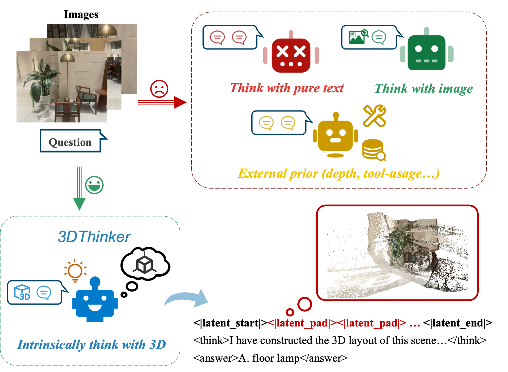

# Think with 3D: Geometric Imagination Grounded Spatial Reasoning from Limited Views
[](https://arxiv.org/pdf/2510.18632)
[](https://huggingface.co/papers/2510.18632)

## Overview


## Codes will be released on mid-November. Please stay tuned...

## Bibtex
If you find 3DThinker helpful for your work, please cite

```
@article{chen2025think,
  title={Think with 3D: Geometric Imagination Grounded Spatial Reasoning from Limited Views},
  author={Chen, Zhangquan and Zhang, Manyuan and Yu, Xinlei and Luo, Xufang and Sun, Mingze and Pan, Zihao and Feng, Yan and Pei, Peng and Cai, Xunliang and Huang, Ruqi},
  journal={arXiv preprint arXiv:2510.18632},
  year={2025}
}
```

